# CDK-Erigon Complete Execution Flow

This document provides a comprehensive sequence diagram of the entire execution flow in CDK-Erigon, from startup to transaction processing and synchronization.

## Holistic Sequence Diagram

```mermaid
sequenceDiagram
    participant User
    participant Node as CDK-Erigon Node
    participant L1 as Layer 1 (Ethereum)
    participant L2 as Layer 2 (zkEVM)
    participant Sequencer as Sequencer
    participant Executor as Executor Service
    participant Prover as Prover/Aggregator
    participant DB as Database

    %% Initialization Phase
    User->>Node: Start CDK-Erigon (./build/bin/cdk-erigon)
    Note over Node: Parse Config & Command Line Args

    %% Log: [INFO] Starting Erigon on devnet=hermez-bali
    Node->>DB: Open Database
    Note over Node,DB: Load Chain Configuration
    
    %% Log: [INFO] Initialised chain configuration
    Node->>Node: Initialize Ethereum Protocol
    
    %% Log: [INFO] Initialising Ethereum protocol network=2440
    Node->>Node: Start Private RPC Server
    
    %% Log: [INFO] Starting private RPC server on=localhost:9092
    Node->>L1: Retrieve Contract Addresses
    
    %% Log: [INFO] Contract addresses retrieved from L1
    Node->>Node: Setup HTTP/WS Endpoints
    
    %% Log: [INFO] HTTP endpoint opened

    %% Synchronization Phase - Stage 1: L1 Syncer
    Note over Node: Stage 1/16: L1Syncer
    
    %% Log: [INFO] [1/16 L1Syncer] Starting L1 sync stage
    Node->>L1: Fetch L1 Blocks
    
    %% Log: [INFO] [1/16 L1Syncer] L1 Blocks processed progress
    L1-->>Node: Return Blocks & Events
    Node->>DB: Save L1 Syncer Progress
    
    %% Log: [INFO] [1/16 L1Syncer] Saving L1 syncer progress

    %% Synchronization Phase - Stage 2: L1 Info Tree
    Note over Node: Stage 2/16: L1InfoTree
    
    %% Log: [INFO] [2/16 L1InfoTree] Starting L1 Info Tree stage
    Node->>DB: Process L1 Info Tree Logs
    
    %% Log: [INFO] [2/16 L1InfoTree] Processed N/M logs, X% complete

    %% Synchronization Phase - Stage 3: Headers
    Note over Node: Stage 3/16: Headers
    
    %% Logs for Headers stage
    Node->>DB: Process Headers

    %% Synchronization Phase - Stage 4: Block Hashes
    Note over Node: Stage 4/16: BlockHashes
    
    Node->>DB: Generate Block Hashes

    %% Synchronization Phase - Stage 5: Bodies
    Note over Node: Stage 5/16: Bodies
    
    Node->>DB: Download Block Bodies
    
    %% Synchronization Phase - Stage 6: Execution
    Note over Node: Stage 6/16: Execution
    
    %% Log: [INFO] [6/16 Execution] Executed blocks
    Node->>Executor: Submit Transactions for Execution
    Executor-->>Node: Return Execution Results
    Node->>DB: Update State

    %% Synchronization Phase - Other Stages
    Note over Node: Stages 7-16: Complete Remaining Stages
    
    %% Operating Modes Based on Configuration
    alt Running as RPC Node
        Note over Node: RPC Node Operation
        
        %% zkEVM Synchronization
        Node->>L1: Monitor for New Batch Events
        L1-->>Node: Notify of New Batch Events
        Node->>L1: Fetch Batch Data
        
        alt Using Datastreamer
            Node->>L2: Connect to Datastreamer
            L2-->>Node: Stream Batch Data
        end
        
        Node->>Executor: Execute Batch Transactions
        Executor-->>Node: Return Execution Results
        Node->>DB: Update L2 State
        
        %% API Handling
        User->>Node: Submit API Request
        Node->>DB: Fetch Requested Data
        Node-->>User: Return API Response
    else Running as Sequencer
        Note over Node: Sequencer Operation
        
        %% Transaction Collection
        User->>Node: Submit Transaction
        Node->>Node: Validate Transaction
        Node->>Node: Add to Transaction Pool
        
        %% Batch Creation
        Node->>Node: Group Transactions into Batch
        Note over Node: Seal Batch (based on time/size)
        
        %% Execution
        Node->>Executor: Execute Batch Transactions
        Executor-->>Node: Return Execution Results
        Node->>Node: Generate State Root
        
        %% L1 Submission
        Node->>L1: Submit Batch Data & State Root
        L1-->>Node: Confirm Submission
        
        %% State Update
        Node->>DB: Update L2 State
    end

    %% Proof Generation and Verification (done by Prover/Aggregator)
    alt Proof Generation Enabled
        Prover->>L1: Fetch Batches to Prove
        L1-->>Prover: Return Batch Data
        Prover->>Prover: Generate Zero-Knowledge Proof
        Prover->>L1: Submit Proof for Verification
        L1-->>Prover: Confirm Proof Verification
    end

    %% Handling Reorgs
    alt L1 Reorg Detected
        L1->>Node: Notify of Chain Reorganization
        Node->>Node: Identify Affected Batches
        Node->>DB: Revert State to Pre-Reorg Point
        Node->>L1: Fetch New Canonical Chain Data
        Node->>Node: Process New Canonical Batches
        Node->>DB: Update State with New Chain
    end

    %% Shutdown Process
    User->>Node: Send Interrupt Signal
    
    %% Log: [INFO] Got interrupt, shutting down...
    Node->>Node: Stop TxGasLogger
    
    %% Log: [INFO] [6/16 Execution] Stopping TxGasLogger
    Node->>Node: Close RPC Servers
    
    %% Log: [INFO] RPC server shutting down
    Node->>DB: Flush Remaining Data
    Node-->>User: Exit Process
```



## System Entry Points and Initialization

The CDK-Erigon node initialization and startup flow involves several key components:

1. **Main Application Entry Point**:
   - Implementation: [`cmd/cdk-erigon/main.go`](../cmd/cdk-erigon/main.go) - The main executable entry point
   - Function: `main()` - Parses command-line flags and initializes the node

2. **Backend Initialization**:
   - Implementation: [`eth/backend.go:262`](../eth/backend.go) - The `New()` function creates the Ethereum backend
   - Implementation: [`eth/backend.go:1321`](../eth/backend.go) - The `Init()` method initializes all components
   - Implementation: [`eth/backend.go:1914`](../eth/backend.go) - The `Start()` method launches all services

3. **Configuration Handling**:
   - Implementation: [`eth/ethconfig/config.go`](../eth/ethconfig/config.go) - Defines configuration options
   - Implementation: [`eth/backend.go:1155-1249`](../eth/backend.go) - Sets up stages based on configuration

4. **Database Initialization**:
   - Implementation: [`eth/backend.go:1073-1114`](../eth/backend.go) - Opens and initializes the database

5. **Mode Selection**:
   - Implementation: [`eth/backend.go:1190-1250`](../eth/backend.go) - Determines if running as sequencer or RPC node
   - Sets up appropriate stages based on the mode

## Mapping to Log Entries

The sequence diagram correlates with actual log entries from the CDK-Erigon execution:

1. **Initialization Phase**:
   ```
   [INFO] Starting Erigon on devnet=hermez-bali
   [INFO] Opening Database label=chaindata path=/Users/carl/Code/crypto/cdk-erigon/testdata/chaindata
   [INFO] [db] open label=chaindata sizeLimit=12TB pageSize=8192
   [INFO] Initialised chain configuration
   [INFO] Initialising Ethereum protocol network=2440
   [INFO] Starting private RPC server on=localhost:9092
   [INFO] Contract addresses retrieved from L1
   [INFO] HTTP endpoint opened ws=true ws.compression=true grpc=false http.url=[::]:8545
   ```

2. **L1 Syncer Stage**:
   ```
   [INFO] [1/16 L1Syncer] Starting L1 sync stage
   [INFO] [1/16 L1Syncer] L1 Blocks processed progress (amounts): 1160000/3126897 (37%)
   [INFO] [1/16 L1Syncer] L1 Blocks processed progress (amounts): 2600000/3126897 (83%)
   [INFO] [1/16 L1Syncer] Saving L1 syncer progress latestCheckedBlock=7921372
   [INFO] [1/16 L1Syncer] Finished L1 sync stage
   ```

3. **L1 Info Tree Stage**:
   ```
   [INFO] [2/16 L1InfoTree] Starting L1 Info Tree stage
   [INFO] [2/16 L1InfoTree] Checking for L1 info tree updates, logs count:5525
   [INFO] [2/16 L1InfoTree] Processed 200/5525 logs, 3% complete
   ...
   ```

4. **Execution Stage**:
   ```
   [INFO] [6/16 Execution] Executed blocks number=2428149 %=31.443 blk/s=492.1 tx/s=814.3
   [INFO] [6/16 Execution] Executed blocks number=2429813 %=31.464 blk/s=55.5 tx/s=316.4
   ```

5. **Shutdown Process**:
   ```
   [INFO] Got interrupt, shutting down...
   [INFO] [6/16 Execution] Stopping TxGasLogger
   [INFO] Exiting...
   [INFO] RPC server shutting down
   [INFO] HTTP endpoint closed url=[::]:8545
   ```

## Key Execution Flows

### 1. Transaction Flow (Sequencer Mode)

1. User submits transaction to the sequencer via RPC
   - Implementation: [`turbo/jsonrpc/zkevm_api.go`](../turbo/jsonrpc/zkevm_api.go) - Handles zkEVM-specific API methods
   
2. Transaction is validated and added to the transaction pool
   - Implementation: [`eth/backend.go`](../eth/backend.go) - Transaction validation and pool management

3. Sequencer batches transactions based on time/size thresholds
   - Implementation: [`zk/stages/stage_sequence_execute.go`](../zk/stages/stage_sequence_execute.go) - Sequencing logic

4. Batch is executed by the executor service
   - Implementation: [`zk/stages/stage_sequence_execute.go`](../zk/stages/stage_sequence_execute.go) - Execution integration

5. State root is calculated for the batch
   - Implementation: [`zk/stages/stage_zk_interhashes.go`](../zk/stages/stage_zk_interhashes.go) - State root calculation

6. Batch data and state root are published to Layer 1
   - Implementation: [`zk/syncer/sequencer.go`](../zk/syncer/sequencer.go) - L1 publishing logic

7. State is updated locally
   - Implementation: [`eth/stagedsync/stage_interhashes.go`](../eth/stagedsync/stage_interhashes.go) - State updates

### 2. Synchronization Flow (RPC Node Mode)

1. Node monitors Layer 1 for new batch events
   - Implementation: [`zk/syncer/l1_syncer.go`](../zk/syncer/l1_syncer.go) - L1 monitoring logic

2. When new batches are detected, batch data is retrieved
   - Implementation: [`zk/stages/stage_batches.go`](../zk/stages/stage_batches.go) - Batch retrieval

3. Batch transactions are executed locally to compute state transitions
   - Implementation: [`eth/stagedsync/stage_execute.go`](../eth/stagedsync/stage_execute.go) - Transaction execution

4. State is updated in the local database
   - Implementation: [`eth/stagedsync/stage_interhashes.go`](../eth/stagedsync/stage_interhashes.go) - State updates

5. Node continues monitoring for new batches
   - Implementation: [`zk/syncer/l1_syncer.go`](../zk/syncer/l1_syncer.go) - Continuous monitoring

### 3. Proof Generation and Verification

1. Prover/Aggregator identifies batches needing verification
   - Implementation: [`zk/prover/prover.go`](../zk/prover/prover.go) - Batch selection for proving

2. Zero-knowledge proofs are generated for these batches
   - Implementation: [`zk/prover/prover.go`](../zk/prover/prover.go) - Proof generation

3. Proofs are submitted to Layer 1 for verification
   - Implementation: [`zk/prover/prover.go`](../zk/prover/prover.go) - Proof submission

4. Layer 1 contracts verify the proofs
   - Implementation: [`zk/contracts/rollup.go`](../zk/contracts/rollup.go) - L1 contract interaction

5. Batches are marked as verified once proofs are accepted
   - Implementation: [`zk/stages/stage_l1_syncer.go`](../zk/stages/stage_l1_syncer.go) - Verification status update

## Synchronization Stages

CDK-Erigon follows a staged synchronization process (16 stages in total):

1. **L1Syncer**: Download Layer 1 blocks and events
   - Implementation: [`zk/stages/stage_l1_syncer.go`](../zk/stages/stage_l1_syncer.go)
   - Stage Definition: [`eth/stagedsync/stages/stages_zk.go:20`](../eth/stagedsync/stages/stages_zk.go)

2. **L1InfoTree**: Process L1 information tree
   - Implementation: [`zk/stages/stage_l1_info_tree.go`](../zk/stages/stage_l1_info_tree.go)
   - Stage Definition: [`eth/stagedsync/stages/stages_zk.go:29`](../eth/stagedsync/stages/stages_zk.go)

3. **Headers**: Process block headers
   - Implementation: [`eth/stagedsync/stage_headers.go`](../eth/stagedsync/stage_headers.go)
   - Stage Definition: [`eth/stagedsync/stages/stages.go:30`](../eth/stagedsync/stages/stages.go)

4. **BlockHashes**: Generate block hashes
   - Implementation: [`eth/stagedsync/stage_blockhashes.go`](../eth/stagedsync/stage_blockhashes.go)
   - Stage Definition: [`eth/stagedsync/stages/stages.go:32`](../eth/stagedsync/stages/stages.go)

5. **Bodies**: Download block bodies
   - Implementation: [`eth/stagedsync/stage_bodies.go`](../eth/stagedsync/stage_bodies.go)
   - Stage Definition: [`eth/stagedsync/stages/stages.go:33`](../eth/stagedsync/stages/stages.go)

6. **Execution**: Execute transactions and update state
   - Implementation: [`eth/stagedsync/stage_execute.go`](../eth/stagedsync/stage_execute.go)
   - Stage Definition: [`eth/stagedsync/stages/stages.go:35`](../eth/stagedsync/stages/stages.go)

7. **IntermediateHashes**: Generate state root
   - Implementation: [`zk/stages/stage_zk_interhashes.go`](../zk/stages/stage_zk_interhashes.go)
   - Stage Definition: [`eth/stagedsync/stages/stages.go:37`](../eth/stagedsync/stages/stages.go)

8. **HashState**: Apply Keccak256 to state keys
   - Implementation: [`eth/stagedsync/stage_hashstate.go`](../eth/stagedsync/stage_hashstate.go)
   - Stage Definition: [`eth/stagedsync/stages/stages.go:38`](../eth/stagedsync/stages/stages.go)

9. **AccountHistoryIndex**: Generate account history index
   - Implementation: [`eth/stagedsync/stage_history_index.go`](../eth/stagedsync/stage_history_index.go)
   - Stage Definition: [`eth/stagedsync/stages/stages.go:39`](../eth/stagedsync/stages/stages.go)

10. **StorageHistoryIndex**: Generate storage history index
    - Implementation: [`eth/stagedsync/stage_history_index.go`](../eth/stagedsync/stage_history_index.go)
    - Stage Definition: [`eth/stagedsync/stages/stages.go:40`](../eth/stagedsync/stages/stages.go)

11. **LogIndex**: Generate logs index
    - Implementation: [`eth/stagedsync/stage_log_index.go`](../eth/stagedsync/stage_log_index.go)
    - Stage Definition: [`eth/stagedsync/stages/stages.go:41`](../eth/stagedsync/stages/stages.go)

12. **CallTraces**: Generate call traces index
    - Implementation: [`eth/stagedsync/stage_call_traces.go`](../eth/stagedsync/stage_call_traces.go)
    - Stage Definition: [`eth/stagedsync/stages/stages.go:42`](../eth/stagedsync/stages/stages.go)

13. **TxLookup**: Generate transaction lookup index
    - Implementation: [`eth/stagedsync/stage_txlookup.go`](../eth/stagedsync/stage_txlookup.go)
    - Stage Definition: [`eth/stagedsync/stages/stages.go:43`](../eth/stagedsync/stages/stages.go)

14. **Finish**: Update current block for RPC API
    - Implementation: [`eth/stagedsync/stage_finish.go`](../eth/stagedsync/stage_finish.go) 
    - Stage Definition: [`eth/stagedsync/stages/stages.go:44`](../eth/stagedsync/stages/stages.go)

15. **Batches**: Process zkEVM batches
    - Implementation: [`zk/stages/stage_batches.go`](../zk/stages/stage_batches.go)
    - Stage Definition: [`eth/stagedsync/stages/stages_zk.go:23`](../eth/stagedsync/stages/stages_zk.go)

16. **Witness**: Process witness data
    - Implementation: [`zk/stages/stage_witness.go`](../zk/stages/stage_witness.go)
    - Stage Definition: [`eth/stagedsync/stages/stages_zk.go:32`](../eth/stagedsync/stages/stages_zk.go)

## Stage Orchestration

The synchronization stages are organized differently based on the node's operating mode:

1. **RPC Node Mode**:
   - Stage configuration: [`turbo/stages/zk_stages.go:26-83`](../turbo/stages/zk_stages.go)
   - Implementation: [`zk/stages/stages.go:224-286`](../zk/stages/stages.go) (`DefaultZkStages` function)
   - Unwind order: [`zk/stages/unwind.go:9-17`](../zk/stages/unwind.go) (`ZkUnwindOrder` variable)

2. **Sequencer Mode**:
   - Stage configuration: [`turbo/stages/zk_stages.go:92-154`](../turbo/stages/zk_stages.go)
   - Implementation: [`zk/stages/stages.go:19-223`](../zk/stages/stages.go) (`SequencerZkStages` function)
   - Unwind order: [`zk/stages/unwind.go:19-26`](../zk/stages/unwind.go) (`ZkSequencerUnwindOrder` variable)

The main entry point for initializing the node is in [`eth/backend.go`](../eth/backend.go), which sets up the appropriate sync stages based on the node's configuration. 